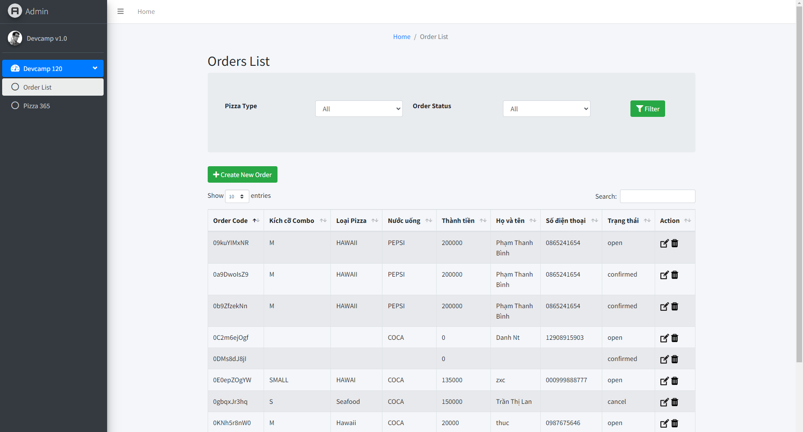
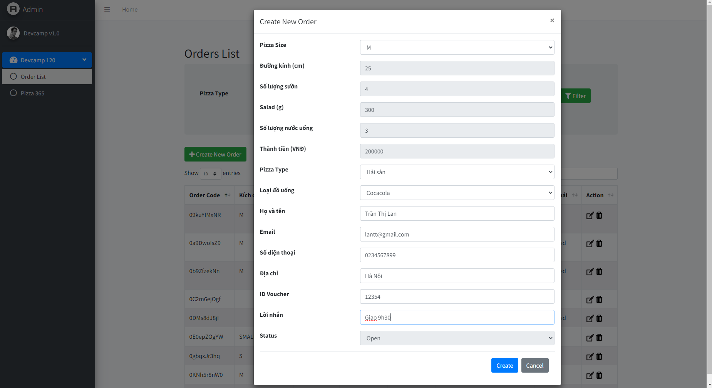
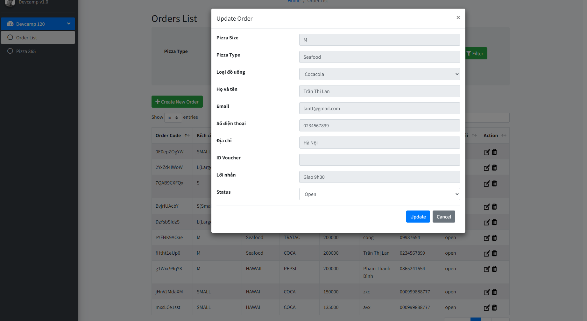
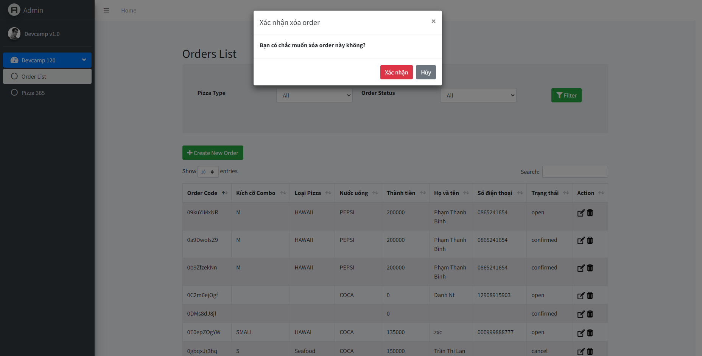

# Pizza 365 v1.0 :pizza:

## Giới thiệu

**Pizza 365** là ứng dụng quản lý đơn hàng pizza trực tuyến. Ứng dụng cho phép người dùng thực hiện các thao tác ***CRUD*** (Create, Read, Update, Delete) trên dữ liệu đơn hàng.

> Dự án được xây dựng trong khuôn khổ chương trình **DevCamp**.

---

## Công nghệ sử dụng

| Công nghệ    | Phiên bản | Mô tả                    |
|--------------|-----------|---------------------------|
| HTML         | 5         | Cấu trúc trang web        |
| CSS          | 3         | Giao diện                  |
| Bootstrap    | 4.5       | Responsive UI framework    |
| JavaScript   | ES6       | Xử lý logic phía client   |
| REST API     | -         | Giao tiếp với server       |

---

## Các chức năng chính

Ứng dụng có **04 chức năng** chính:

### 1. Hiển thị danh sách đơn hàng

Hiển thị toàn bộ danh sách đơn hàng từ server dưới dạng bảng.



### 2. Tạo đơn hàng mới

Cho phép người dùng nhập thông tin và tạo đơn hàng mới.



### 3. Sửa đơn hàng

Cho phép cập nhật thông tin đơn hàng đã có.



### 4. Xóa đơn hàng

Cho phép xóa đơn hàng khỏi hệ thống.



---

## Cài đặt và sử dụng

### Yêu cầu

- Trình duyệt web (Chrome, Firefox, Edge)
- VS Code (khuyến nghị)
- Kết nối internet (để gọi REST API và Bootstrap CDN)

### Hướng dẫn chạy

1. Clone dự án về máy
2. Mở thư mục dự án bằng **VS Code**
3. Mở file `index.html` bằng trình duyệt
4. Sử dụng các chức năng trên giao diện

---

## Cấu trúc thư mục

```
pizza365/
├── images/
│   ├── 01_img_chuc_nang_hien_ds_don_hang.png
│   ├── 02_img_chuc_nang_tao_don_hang.png
│   ├── 03_img_chuc_nang_sua_don_hang.png
│   └── 04_img_chuc_nang_xoa_don_hang.png
├── index.html
├── detail.html
├── update.html
└── readmePizza365.md
```

---

## API Endpoints

| Method   | Endpoint          | Mô tả                  |
|----------|-------------------|-------------------------|
| `GET`    | `/users`          | Lấy danh sách users     |
| `GET`    | `/users/{id}`     | Lấy chi tiết 1 user     |
| `PUT`    | `/users/{id}`     | Cập nhật thông tin user  |
| `DELETE` | `/users/{id}`     | Xóa 1 user              |

---

## Tác giả

- **Học viên DevCamp**
- Liên hệ: [DevCamp](https://devcamp.edu.vn)

---

## Ghi chú

> :bulb: Đây là dự án học tập, dữ liệu được lưu trên server thông qua REST API.

~~Phiên bản cũ~~ **Phiên bản mới v1.0**

*Cảm ơn bạn đã xem dự án!*
